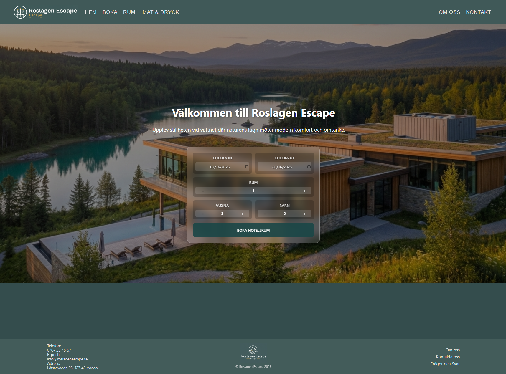
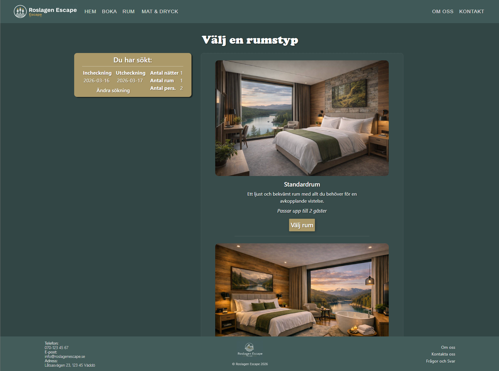
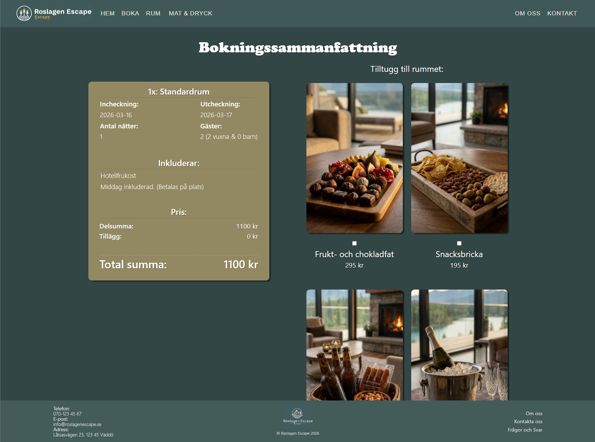
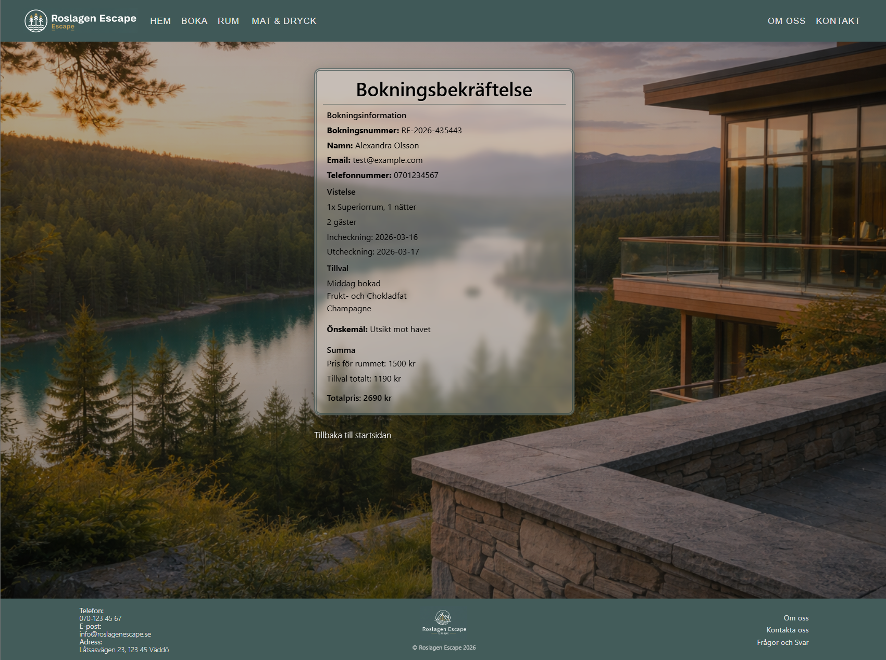

# Roslagen Escape – Hotel Booking Website
🚧 Work in progress

Roslagen Escape is a fictional hotel booking website built as a full-stack practice project.  
The goal of the project was to simulate a real hotel website where users can explore rooms, view menus, and go through a booking flow.

The project focuses on building a **responsive frontend application with React**, while also practicing **backend development with Java and Spring Boot**.

---

# Live Demo

https://alexandrao93.github.io/hotel-booking/

---

# Features

- Responsive hotel website
- Room overview and room information
- Food & drink menus
- Booking search functionality
- Checkout flow with booking form
- Booking confirmation page
- Contact form
- Reusable components and structured layout
- Generated booking reference numbers

---

# Tech Stack

## Frontend

- React
- React Router
- Vite
- CSS (custom styling with responsive layout)

## Backend

- Java
- Spring Boot
- REST API
- Pagination
- Validation logic

---

# Project Structure
src
│
├── components
│ ├── Navbar
│ ├── Footer
│ ├── BookingBar
│ └── BookingForm
│
├── pages
│ ├── Home
│ ├── Booking
│ ├── Room
│ ├── Checkout
│ ├── Confirmation
│ ├── Food-drinks
│ ├── Breakfast
│ ├── A-la-carte
│ ├── Kids-menu
│ ├── Contact
│ ├── About-us
│ └── Qa
│
└── App.jsx

The project uses **page-based routing** with reusable **component-based UI elements**.

---

# Booking Flow

The booking process follows a multi-step flow:

1. User searches for available dates and number of guests
2. Available rooms are displayed
3. The user selects a room and optional add-ons
4. The user fills in booking information
5. A booking confirmation page is generated

A booking reference number is automatically generated for each completed booking.

---

# Design Principles

This project was built with the following principles in mind:

- Component-based architecture
- Separation between pages and reusable components
- Responsive layout
- Clear routing structure
- Clean and readable code structure

---

# Future Improvements

Some planned or possible improvements include:

- Fully connecting the booking flow to the backend API
- Storing bookings in a database
- Implementing authentication
- Improving form validation and error handling
- Extracting shared utilities and constants
- Adding automated tests

---

# Screenshots

## Home page

## Booking page

## Checkout

## Confirmation

---

# Author

Alexandra Olsson

Student – Java Developer with Cloud specialization  
Jensen Yrkeshögskola

---

# Purpose of the Project

This project was built as a learning project to practice:

- modern frontend development with React
- routing and page structure
- reusable component architecture
- building a booking flow
- backend API development with Java and Spring Boot
